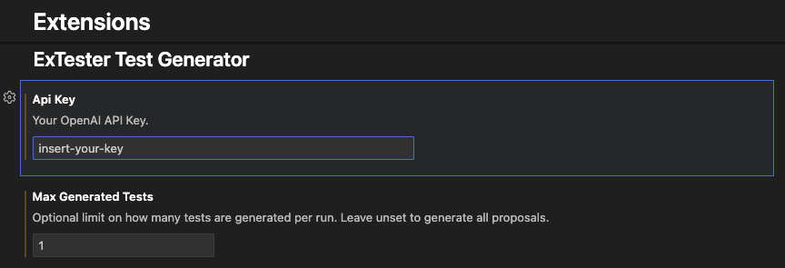
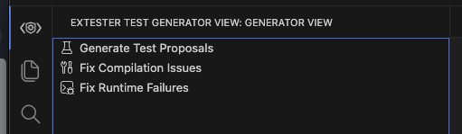
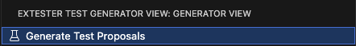
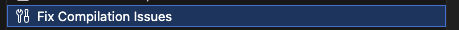
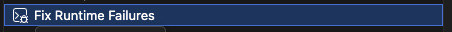
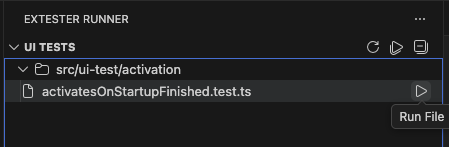

# extester-code-generator-example

## Description
This is example project for purpose of testing extester-code-generator. This repository contains example extension which already have all necessarities predefined, so you can directly generate tests. 

## Prerequisites
- [Node.js](https://nodejs.org/) and [npm](https://www.npmjs.com) 
- [VS Code](https://code.visualstudio.com/) version `1.99.0` or newer
- [extester-code-generator](https://github.com/pospisilf/extester-code-generator)
- [OpenAI API key](https://platform.openai.com/settings/organization/api-keys)
- [ExTester Runner](https://github.com/redhat-developer/vscode-extension-tester/tree/main/packages/extester-runner) [optional]

## Setup
### 1. step
Clone repository with `extester-code-generator-example`
```bash
git clone https://github.com/pospisilf/extester-code-generator-example.git

git clone git@github.com:pospisilf/extester-code-generator-example.git
```

### 2. step
Install dependencies
```bash
npm ci
```

### 3. step
Open VS Code and set OpenAI API key


Note: for getting better idea of how does extension work I also recommend to limit number of tests to 1
it will improve stability in next steps as this extension is still in a state "proof of concept"

### 4.step
Open extester-code-generator view from sidebar (Activity Bar icon)



### 5. step
Generate Test Proposals and review the generated list before proceeding.




### 6. step (optional, only if there is a compilation error)
If the generated test fails to compile, use the fix action to regenerate with corrections.



### 7. step (optional, only if there is a runtime failure)
If the test compiles but fails at runtime, apply the runtime fix flow and re-run.



### 8. step
Run tests using terminal (re-run after any fixes)
```bash
npm run ui-test
```
or use ExTester runner (recommended)


